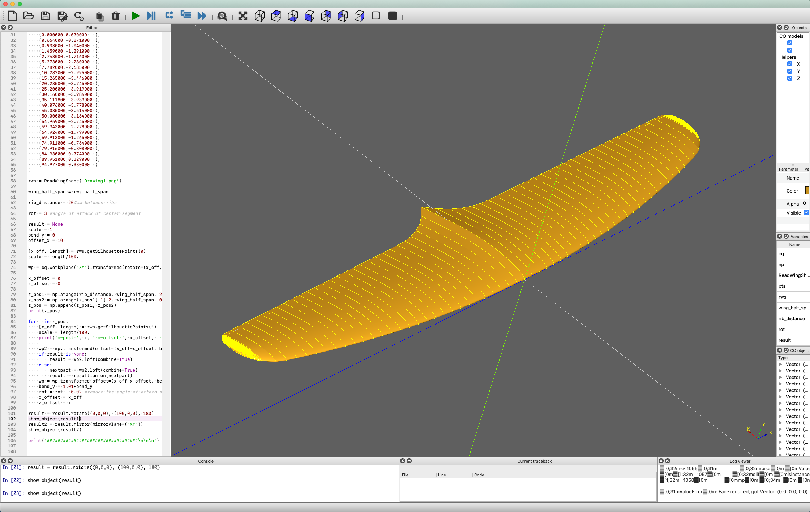

## Short Proof of Concept
For using CadQuery as a tool to design hydrofoil wings.

The code is separated over two files.

* __readPic.py__ reads the silhouette of the wing from a png file (silhouette.png), interpolates the found data points and provides a function for querying the y-coordinate for the leading edge and the length of a wing segment for a given x-position.

* __main.py__ holds the CadQuery script for drawing the wing in the cq-editor.

Also included are:

* __s7075-il.csv__ and __e1098-il.csv__, two wing profiles from [airfoiltools.com](airfoiltools.com)

* __silhouette.png__ the wing's silhouette as PNG with 100 pixel/cm resolution (the 100 pixel/cm are not required, it can be any resolution really as long as the code can interpolate properly)

### Conclusions
Although the design process is quick and comparably easy my feeling suggests that there are better solutions in hinsight of the design process. Over the next weeks I will try packages/software/libraries like FreeCAD, Rhino3D+Grasshopper, CATIA, Fusion360 and others..
